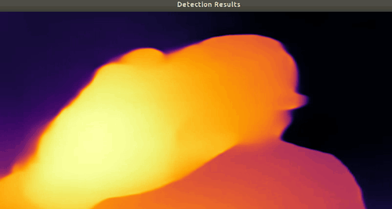

# Object-looked-at Estimation
Model that estimate the object you look at

## DepthAI version

Work In Progress...  

### First test on mono camera (OAK-1)

**Gaze estimation + Mobilenet-SSD:** 

The model currently run at 24 FPS (on i7-8700 host).

**Intersection detection between detection-bboxs and gaze:**  

#### TODO

* Integration of Midas V2 model (MonoDepth)

Midas V2 running on NCS2:  

